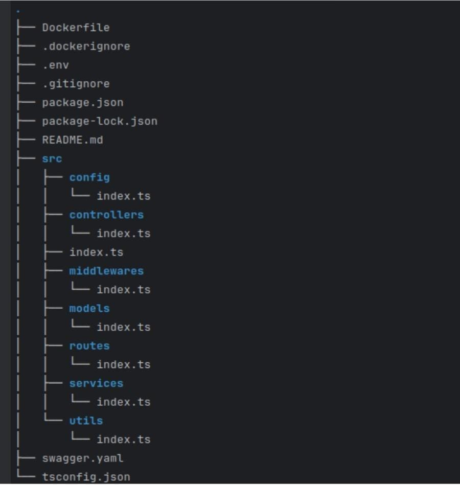

## EzPress !!!

A CLI tool to initialize a new express project with in TypeScript with a clean architecture and a set of files that are commonly used in every project.

All files have the necessary, commonly used code to get started with a new project.
### Project Structure


### Installation
```bash
  npm install -g ez-press
```

### Usage
```bash
  ez-press init <project-name>
```
